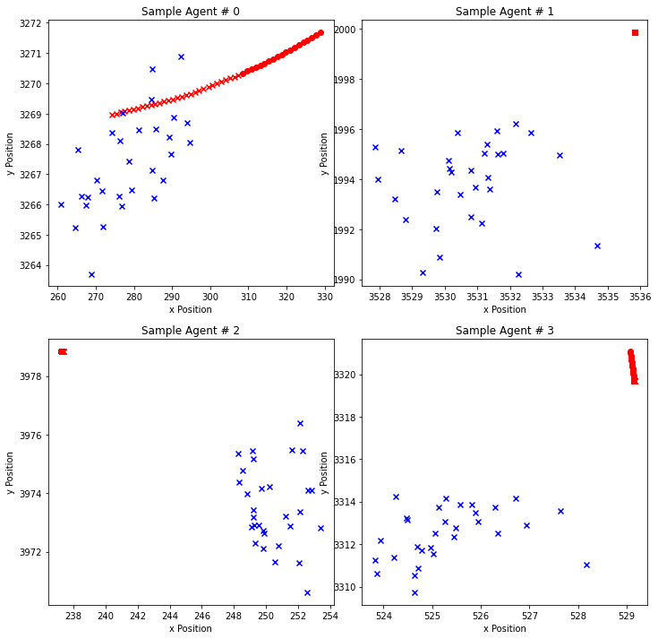

<object data="/CSE_151B_Final_Report.pdf" type="application/pdf" width="100%"> 

# Autonomous Vehicle Motion Forecasting Challenge
This project predict the motion of vehicles in a given scene. Using the past positions and velocities of all the vehicles as well as the positions and directions of lanes in a scene, we want to predict the motion of a particular vehicle. Our model for prediction needs to incorporate and consider not only the position and velocity of the vehicle in question, but also environmental factors such as traffic caused by other vehicles, changing directions of lanes as well as the city in which the scene is taking place. Studying problems of this type is extremely useful in the real world as they heavily relate to the optimization of autonomous vehicles which are increasingly popular. If we can predict the safe and correct motion of a vehicle in a given scene, then this could help create safer and more reliable self-driving vehicles.



The goal of the motion forecasting task is to predict the positions of a tracked object 3 seconds into the future, given an initial 2-second observation. We obtained a final Root Mean Squared Error (RMSE) of 2.80422.

## Dataset 
The training, validation, and test sequences are taken from different areas of Pittsburgh and Miami so that there is no geographical overlap. Each sequence follows the trajectory of the main agent for 5 seconds, while keeping track of all other agents including cars and pedestrians. Agents follow very complex trajectories, such as changing lanes, navigating intersections, and turning. We also provide the HD map information that is associated with the trajectory.  
For each scene, we are provided a dictionary consisting of 11 items- lane, lane_norm, city, scene_idx,
agent_id, car_mask, track_id, p_in ,p_out, v_in, v_out:
* *lane* - (k,3) numpy array of floats where k = number of lanes
* *lane_norm* - (k,3) numpy array of floats where k = number of lanes
* *city* - (k,3) numpy array of floats where k = number of lanes
* *scene_idx* - unique non-zero integer
* *agent_id* - a string of the form "00000000-0000-0000-0000-0000XXXXXXXX" where X is 0 to 9
* *car_mask* - (60, 1) numpy array of float 1’s and 0’s
* *track_id* - (60,30, 1) numpy array of strings where string format is "00000000-0000-0000-0000-0000XXXXXXXX" and X is 0 to 9
* *p_in* - (60, 19, 2) numpy array of floats
* *v_in* - (60, 19, 2) numpy array of floats
* *p_out* - (60, 30, 2) numpy array of floats
* *v_out* - (60, 30, 2) numpy array of floats

## Implementation 
All methods are implemented as Jupyter notebook in ```methods/```, with each of them being self-contained such that they can load the data, run corresponding algorithm on train and validation data, and generate output.
* Physics simulation (```UsingPhysics.ipynb```): compute exponential moving average of the positions and velocities from previous tempsteps for the final predicitons. This is used as a reference answer for initial testing. 
* Multi-Perceptron fully connected NN (```Fully - Connected Neural Network.ipynb```): Two linear layers concatenated 20 time-steps as the model input with output of concatnated 30 time-steps
* Single LSTM (```LSTM - Sliding Window - Predict 30 TimeSteps.ipynb```): LSTM implementation with 19 LSTM cells and one Conv1d layer to output 30 timesteps directly.
* Sliding-Window LSTM (```LSTM - Sliding Window - Predicing Next TimeStep.ipynb```): On top of standard LSTM implmentation, we predict next time step with first 19 observations, but then for each following time step, we append all previous predictions such that we have more previous observation in that sense for the next prediction. THe final result is then again concatenation of all 30 predicted time steps. A visualization of this sliding window is shown below. 


## Usage
* Launch the [Kaggle competition page](https://www.kaggle.com/competitions/cse151b-spring/data), download the data as instructed, and store the training and validation data into ```new_train``` and ```new_val_in``` folder respectively.
* Run any implemented notebooks from ```methods/```for different methods to generate outputs 
* Predicted output for the unseen test data can be submitted to the [Kaggle competition page](https://www.kaggle.com/competitions/cse151b-spring/data) to check accuracy and compare to other competitors.

</object>
